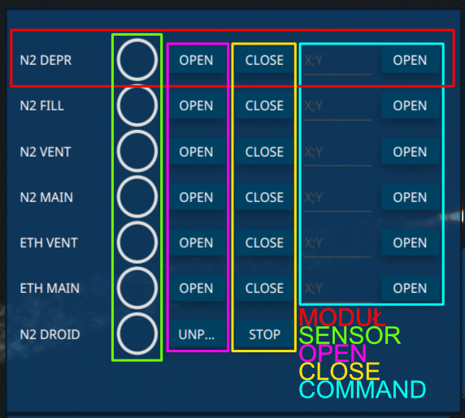

## BaseButtonSensorCommandsController
Połączenie BaseButtonSensorController i BaseCommandsController



W ramach jednego modułu można zdefiniować:
* Indicator
* Przycisk otwierania (lub o podobnej funkcjonalności)
* Przycisk zamykania (lub o podobnej funkcjonalności)
* Przycisk komend wraz z polem na podanie danych

**Nazewnictwo**

Kontroler automatycznie paruje ze sobą odpowiednie przyciski oraz indicatory jednak aby robił to poprawnie, należy przestrzegać odpowiednich konwencji nazewnictwa.

1. **Część główna**
    
    Część główna pozwala kontrolerowi połączyć ze sobą odpowiednio komponenty
   * Sensor — W tym przypadku kontroler będzie czytał nazwę z pola "name". Wielkość liter oraz spacje nie są brane pod uwagę.
   * Command — Tutaj kontroler będzie sugerował się polem "commandTriggerKey". Wielkość liter nie ma znaczenia, spację nie są ignorowane.

2. **commandType**

    CommandType to dodatkowe pole, które służy do określenia funkcjonalności, pozwala zrozumieć kontrolerowi gdzie umieścić komponent oraz czy należy stworzyć dla niego dodatkowe elementy. Sufiks dodajemy tylko dla Command

**Przykład (N2 DEPR)**

1. Część główna

```
{ //12
    "type": "Sensor",
    "destination": "dataIndicator1",
    "name": "N2 DEPR",
    "destinationControllerNames": [
      "ValvesPressurizing"
    ],
    "isBoolean": true,
    "hidden": false
}
```
W typ przypadku część główna to "n2depr" wszystkie komponenty z tą samą częścią główną będą umieszczone w tym samym module.

2. commandType

```
{ // n2 depr open
    "type": "ProtobufCommand",
    "value": {
    "device": "OBC",
    "system": "TANWA",
    "command": "0x53"
    },
    "trigger": "n2Depr",
    "description": "OPEN",
    "commandType": OPEN,
    "destinationControllerNames": [
    "ValvesPressurizing"
    ],
    "isFinal": true
}
```
commandType to OPEN a część główna to "n2depr". Dzięki temu kontroler umieści dany przycisk w odpowiednim module oraz w odpowiedniej kolumnie (OPEN)

**MOŻLIWE COMMAND TYPE**

Możliwe commandType są zdefiniowane w enum commandType.java

* OPEN — zwykły przycisk. Przypisana mu komenda nie może przyjmować dodatkowych argumentów, "isFinal": true.
* CLOSE — zwykły przycisk. Przypisana mu komenda nie może przyjmować dodatkowych argumentów, "isFinal": true.
* INPUT_COMMAND — dodatkowo automatycznie wygeneruje odpowiadające mu pole Input. Przypisana mu komenda może obsługiwać dodatkowy payload.

**KOLEJNOŚĆ GENEROWANIA**

Kontroler wygeneruje moduły w odpowiedniej kolejności:
* Moduły ze zdefiniowanymi sensorami
  * W tym przypadku jesteśmy w stanie zdefiniować kolejność generowania. Kolejność jest ustalona przez pole "destination" - alfabetycznie. Najlepszą praktyką jest używać konwencji **"dataIndicator" + numer**
* Reszta modułów
  * Nie ma możliwość decydowania o kolejności jak zostaną one wygenerowane

**DODATKOWE UWAGI**

* Tekst, który jest umieszczony na Label to nazwa sensora (name)
* Indicator jest tworzony razem z sensorem
* Tekst na przyciskach jest definiowany w polu "description"
* Nie należy definiować dwóch komend o tej samej części głównej i tym samym commandType
  * Literówki sprawią, że dany element się nie wygeneruje!!!
    * Komendy w ramach tego samego modułu są rozróżniane przez commandType, commandTriggerKey jest takie same dla każdej komendy jednak jest to uwzględnione w logice kontrolera
      * **przykład:**
    ```
        {
            "commadTriggerKey": "trigger",
            "commandType": OPEN
        },
        {
            "commadTriggerKey": "trigger",
            "commandType": CLOSE
        }
    ```